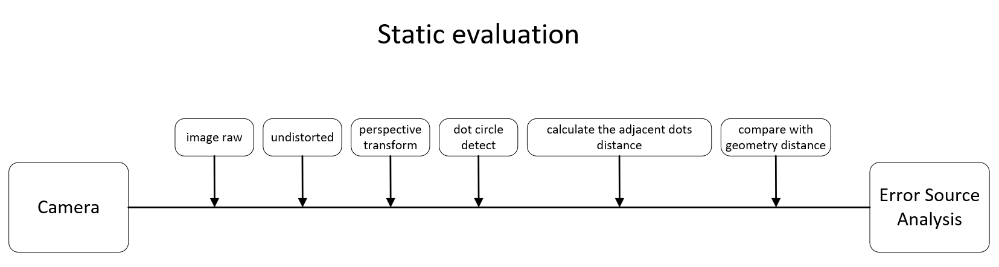
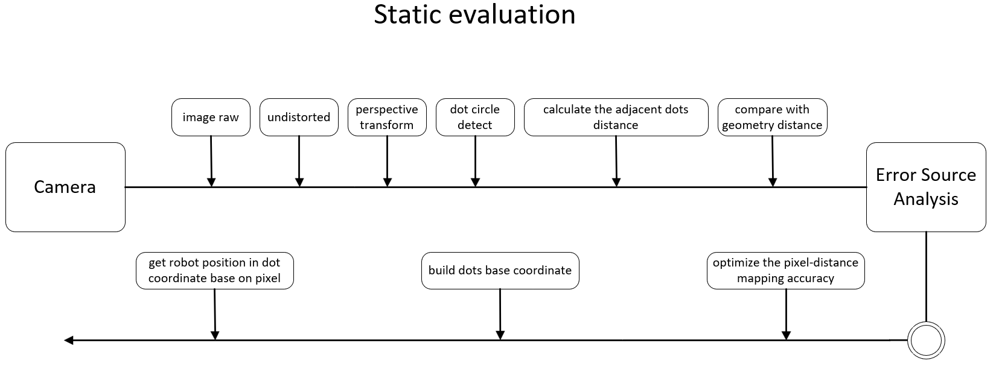
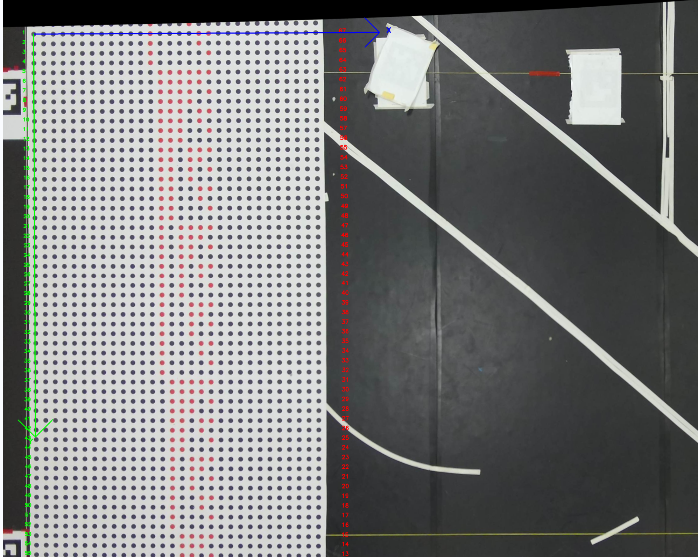

# Dot Based Evaluation




```
# 2k
roslaunch dots_ucs circle_grid_auto_pattern_2k.launch


# 4k
roslaunch dots_ucs circle_grid_auto_pattern_4k.launch

```

## Error Analysis and Visualize
```
python3 test_tools.py
```




## dots based coodinate
