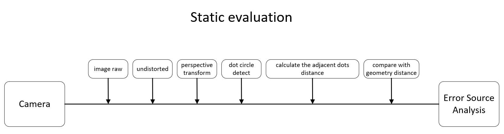
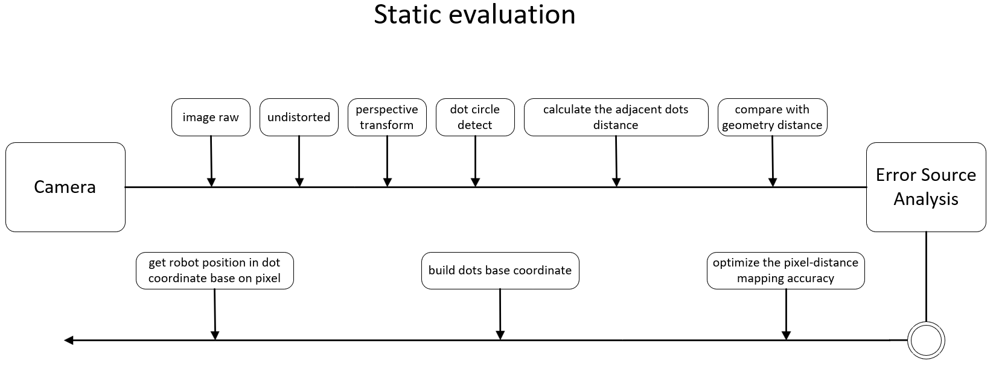
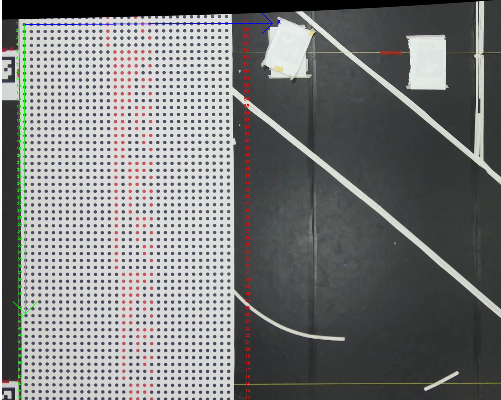

# Dot Based Evaluation




1. First, open camera driver or play rosbag which contain camera images
```
### open camera drive(Choose one resolution)
# 2k
roslaunch usb_cam_cv gulliview_camera_publisher_2k.launch
# or 4k
roslaunch usb_cam_cv gulliview_camera_publisher_4k.launch


### Or play rosbag
# rosbag play 2024-12-11-21-47-46.bag --clock --pause --loop
rosbag play bag_name.bag --clock
```


2. Lunch nodes
```
# 2k (Choose one resolution, load different camera parameters)
roslaunch dots_ucs circle_grid_auto_pattern_2k.launch


# or 4k
roslaunch dots_ucs circle_grid_auto_pattern_4k.launch

```

## Error Analysis and Visualize
```
python3 test_tools.py
```
[Error Analysis.pdf](./Error%20Analysis.pdf)

[5.3 Dot Based Evaluation.pdf](./5.3%20Dot%20Based%20Evaluation.pdf)

## dots based coodinate



