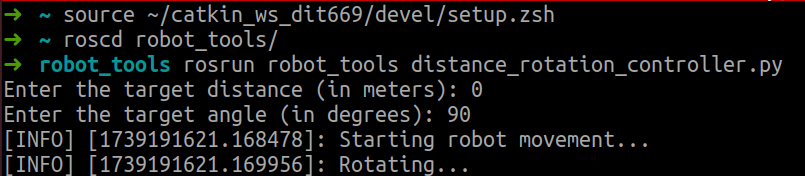
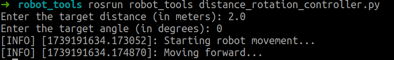

# Run the wifibot drivers
```
wbb
rlaunch #starts the drivers

rkeyboard #starts the keyboard controller
```

# Calibrate the Wifibot odometry
The calibration of the Wifibot chassis involves separately measuring and adjusting its linear velocity and angular velocity. The purpose of this calibration is to improve the automated evaluation of whether the coordinates provided by Gulliview are accurate. Before this evaluation, it is essential to ensure that the chassis can precisely execute control commands, such as rotating 90 degrees in place or moving in a straight line for 2 meters and return precise odometry feeback.


```
rosrun robot_tools distance_rotation_controller.py
```


Calibration of the chassis's angular velocity: This involves issuing a command for the chassis to rotate by a fixed angle. The chassis should then rotate at a constant angular velocity until it reaches the predetermined angle.



Calibration of the chassis's linear velocity: This involves issuing a command to move the chassis a distance of 2 meters. The chassis should then move in a straight line at a constant linear velocity for the specified distance.



This calibration process ensures that the Wifibot can accurately perform both linear and rotational movements, which is critical for validating the accuracy of the coordinates provided by Gulliview.


Otherwise, adjust the **Wifibot chassis drive** until the executed control commands match the actual performance.

```
# driver  
_pDriver->setPid(0.8, 0.45, 0.0);  // Proportional, Integral, Derivative  

# Slow movement or high precision scenarios  
_pDriver->setPid(0.6, 0.3, 0.1);   // Proportional, Integral, Derivative  

_entrax = 0.45;  // Track width in meters  

# 336 mm track/wheel diameter, wheel diameter is 0.25m  
_pDriver->setTicsPerMeter(428.65); // Set ticks per meter for encoder
```
